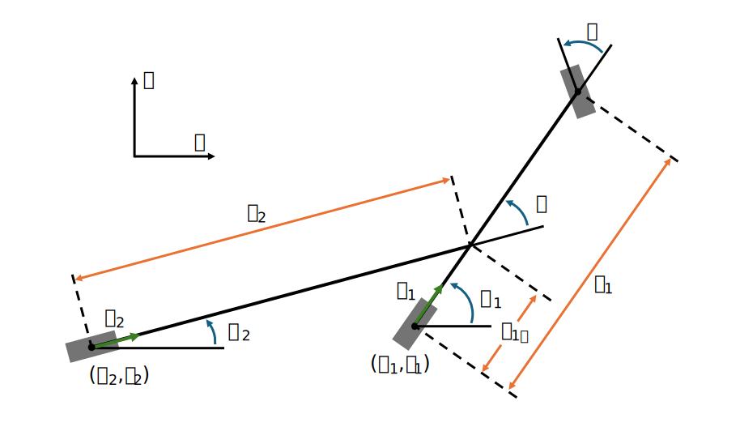
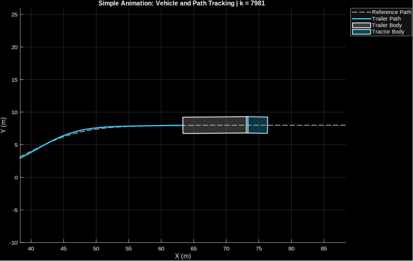

# Truck-Trailer MPC in MATLAB

This repository contains a MATLAB-based model predictive control (MPC) prototype for truck-trailer path tracking. The current codebase is set up as a research and debugging workspace rather than a packaged software release: the main script builds a reference path, linearizes and discretizes the vehicle model, solves a finite-horizon QP with qpOASES, simulates the closed-loop response, and exports logs and figures for offline analysis.

Truck-trailer vehicle model used by the controller and kinematic propagation in this repository.

Example simulation snapshot exported by `script_MPC_Rev1.m` during a debug run.

## Current Status

This project is in progress and is primarily organized for experimentation, controller iteration, and debugging. Expect active development, hard-coded scenario settings in the main script, and rough edges around setup and reproducibility.

## Requirements

- MATLAB
- The bundled `qpOASES-slim` folder included in this repository
- A compatible qpOASES MEX binary for your platform

The current entry script checks that `qpOASES-slim` exists and that the qpOASES MEX file is present before running. Exact MATLAB version and toolbox requirements are not yet pinned in the repo, so treat the setup as MATLAB-first and verify any missing functions against your local installation if needed.

## Quick Start

1. Open this repository in MATLAB.
2. Open [`script_MPC_Rev1.m`](script_MPC_Rev1.m).
3. Review the top-level settings near the top of the script:
   - `ux` for constant longitudinal speed
   - `Nsim` for the number of simulation steps
   - `save_debug_outputs` to enable or disable exported logs and figures
   - `path_type` to choose the reference path
   - `init_mode` and the initial state / path anchor values
4. Run `script_MPC_Rev1`.

The script adds the bundled qpOASES folder to the MATLAB path and will stop early with an error if the expected qpOASES MEX binary is not available.

## Project Structure

- [`script_MPC_Rev1.m`](script_MPC_Rev1.m): main entry script for path setup, MPC loop, plotting, animation, and optional debug export
- [`parameters.m`](parameters.m): constant vehicle, sampling, horizon, constraint, and cost-weight settings
- [`truck_trailer_model.m`](truck_trailer_model.m): continuous and discrete affine model generation
- [`optimization.m`](optimization.m): MPC QP assembly and qpOASES solve
- [`reference_generator.m`](reference_generator.m): reference construction over the prediction horizon
- [`segment_manager.m`](segment_manager.m): path segment / mode association logic
- [`path_generation.m`](path_generation.m): reference-path creation
- [`plant_propagation.m`](plant_propagation.m): closed-loop state propagation
- [`get_measurements.m`](get_measurements.m): reconstructed vehicle measurements used by the controller and plots
- [`symbolic_model_derivation.m`](symbolic_model_derivation.m): symbolic model helper / derivation workflow
- [`qpOASES-slim/`](qpOASES-slim): bundled solver interface and MEX binary

## Outputs / Debug Artifacts

When `save_debug_outputs = true`, the script creates a timestamped folder under `debug_runs/`:

- `debug_runs/YYYYMMDD_HHMMSS/mpc_debug_run.mat`
- exported figure files in SVG format

The saved MAT file includes controller and simulation logs, the generated path, run metadata, and the simulation time vector. The exported figures capture the diagnostic plots generated during the run so they can be inspected later without rerunning the controller.

## Notes / Limitations

- This repo is currently script-driven rather than packaged as a reusable MATLAB app or toolbox.
- Scenario selection is configured directly in the script instead of through a separate config file or UI.
- Supported built-in path scenarios currently include `merge`, `line`, `circle`, `figure8`, and `parkingfr`.
- The README intentionally avoids claiming exact MATLAB version or toolbox support because those requirements are not yet documented in the repo.

